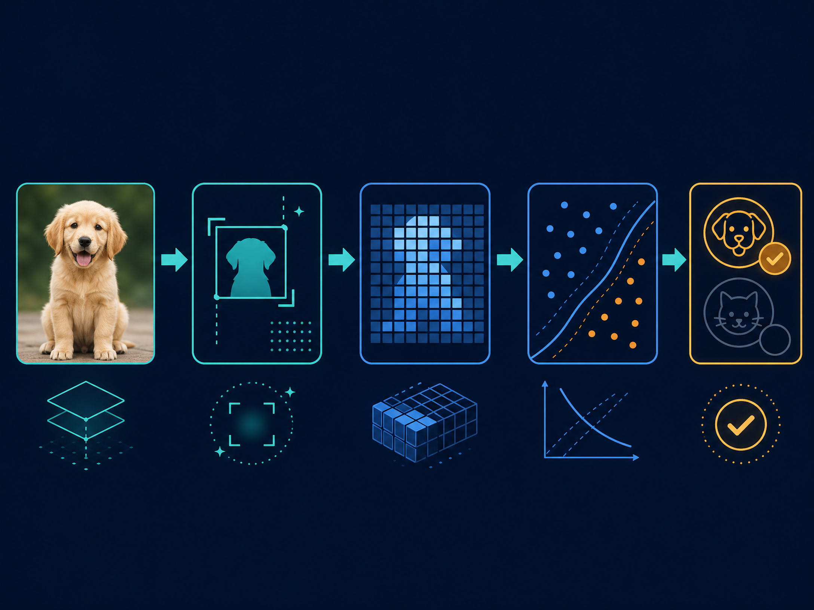

# Cats & Dogs Image Classifier

> A reproducible computer-vision project that classifies pet images as **cat** or **dog** using a Support Vector Machine (SVM).

<p align="center">
  
</p>

<p align="center">
  <strong>Traditional machine learning · Reproducible training · Clear evaluation artifacts</strong>
</p>

## نبذة عربية

هذا المشروع يطبّق خط أنابيب كامل لتصنيف صور القطط والكلاب. تتم قراءة الصور وتحويلها إلى RGB، وتغيير حجمها إلى **40×40** بكسل، وتطبيع القيم، ثم تحويلها إلى متجهات رقمية يدرّب عليها نموذج **SVM**. يتضمن المستودع سكربتات مستقلة للتدريب والتنبؤ، بحثًا عن أفضل المعلمات، إنشاء مصفوفة الالتباس ومنحنى ROC، واختبارات آلية بسيطة.

## Project overview

The repository is intentionally built as a transparent baseline rather than a deep-learning system. Each image is converted into a normalized RGB feature vector, and an SVM is tuned with cross-validation before the final model is evaluated on a held-out test split. SVMs are a supervised-learning method that can construct decision boundaries between classes [1]. Image resizing and normalization make the input shape consistent across samples [2].

<p align="center">
  
</p>

## What is included

| Component | Purpose |
| --- | --- |
| `utils.py` | Robust RGB conversion, image resizing, dataset loading, and evaluation plots. |
| `train.py` | Dataset loading, stratified split, SVM hyperparameter search, metrics, and model serialization. |
| `predict.py` | Single-image inference with confidence display and an annotated preview image. |
| `notebook.ipynb` | Exploratory academic walkthrough of the original methodology. |
| `tests/` | Fast tests for grayscale conversion and supported dataset layouts. |
| `.github/workflows/tests.yml` | Continuous integration workflow that runs the test suite. |
| `assets/` | Original visual assets used by this README. |
| `results/` | Generated evaluation figures and JSON metrics. |
| `artifacts/` | Local trained model bundles; intentionally ignored by Git. |

## Dataset layout

The dataset is not committed to this repository. Place it locally in either of the following supported layouts:

```text
dataset/catsAndDogs40/
├── cat/
│   ├── image_001.jpg
│   └── image_002.jpg
└── dog/
    ├── image_001.jpg
    └── image_002.jpg
```

or:

```text
dataset/catsAndDogs40/
├── train/
│   ├── cat/
│   └── dog/
└── test/
    ├── cat/
    └── dog/
```

Supported image formats are **JPG, JPEG, PNG, BMP, and WEBP**. Before using a dataset, verify its license and ensure that it can legally be used for your intended purpose.

## Installation

```bash
git clone https://github.com/abodjmal2004/ImageClassifier.git
cd ImageClassifier
python -m venv .venv
source .venv/bin/activate        # Windows: .venv\\Scripts\\activate
python -m pip install --upgrade pip
python -m pip install -r requirements.txt
```

## Train the model

The default command expects the dataset at `dataset/catsAndDogs40` and writes the model to `artifacts/svm_model.joblib`:

```bash
python train.py
```

For a faster demonstration run with a smaller search grid:

```bash
python train.py --quick
```

Custom paths and cross-validation settings are also supported:

```bash
python train.py \
  --data-dir path/to/dataset \
  --model-path artifacts/custom-model.joblib \
  --results-dir results \
  --cv 3
```

Training produces the following local artifacts:

| Output | Description |
| --- | --- |
| `artifacts/svm_model.joblib` | Model bundle containing the estimator, class names, and image size. |
| `results/metrics.json` | Accuracy, best parameters, sample counts, and the classification report. |
| `results/confusion_matrix.png` | Heatmap of true versus predicted labels. |
| `results/roc_curve.png` | ROC curve and AUC when both classes are present in the test split. |

The model is saved as a bundle instead of a bare estimator so that inference retains the preprocessing dimensions and class labels. Evaluation outputs follow common classification-report and ROC-curve conventions [3].

## Predict one image

After training, classify an image and save an annotated preview:

```bash
python predict.py \
  --image path/to/pet.jpg \
  --model-path artifacts/svm_model.joblib \
  --output results/prediction.png
```

The command prints the predicted class and, when probability estimates are available, the model confidence. The preview image is saved locally and is not committed by default.

## Run tests

```bash
python -m pytest -q
```

The tests do not require the real dataset. They generate small temporary images to verify that grayscale images become three-channel RGB inputs and that both supported directory layouts are loaded correctly.

## Methodology and limitations

This project is a deliberately understandable baseline. It is useful for learning the end-to-end workflow, but it should not be treated as a production-grade pet-recognition system. A 40×40 flattened image discards spatial structure, and an SVM may be outperformed by a convolutional neural network or a transfer-learning model on a sufficiently large and diverse dataset. Results can also be affected by class imbalance, image quality, lighting, background, and data leakage.

For a stronger next iteration, compare this baseline with a pretrained vision model, add a fixed validation protocol, track experiments, and report per-class precision, recall, F1-score, and calibration rather than relying on accuracy alone.

## References

[1]: https://scikit-learn.org/stable/modules/svm.html "Scikit-learn Support Vector Machines"
[2]: https://scikit-image.org/docs/stable/api/skimage.transform.html#skimage.transform.resize "scikit-image resize documentation"
[3]: https://scikit-learn.org/stable/modules/model_evaluation.html "Scikit-learn model evaluation documentation"

## License and dataset notice

No dataset is distributed with this repository. Add the appropriate license for the source code and confirm the separate dataset license before publishing trained artifacts or example images.
